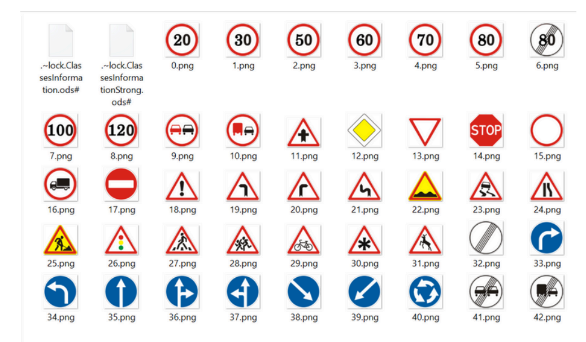
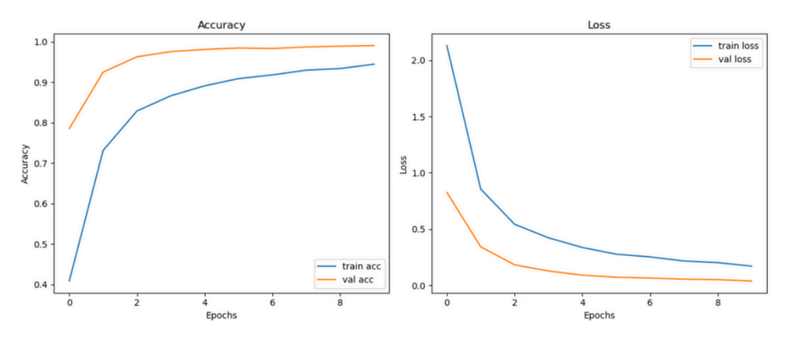
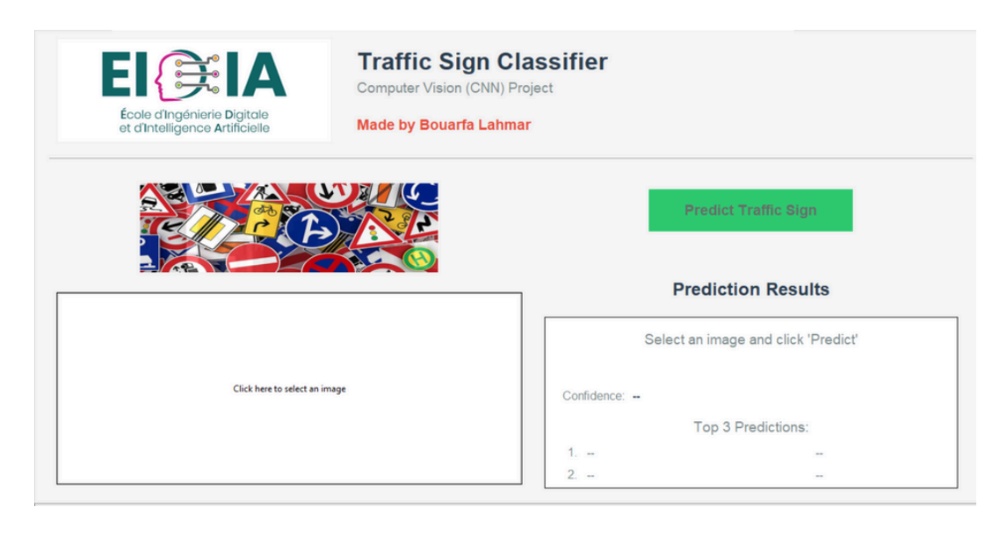
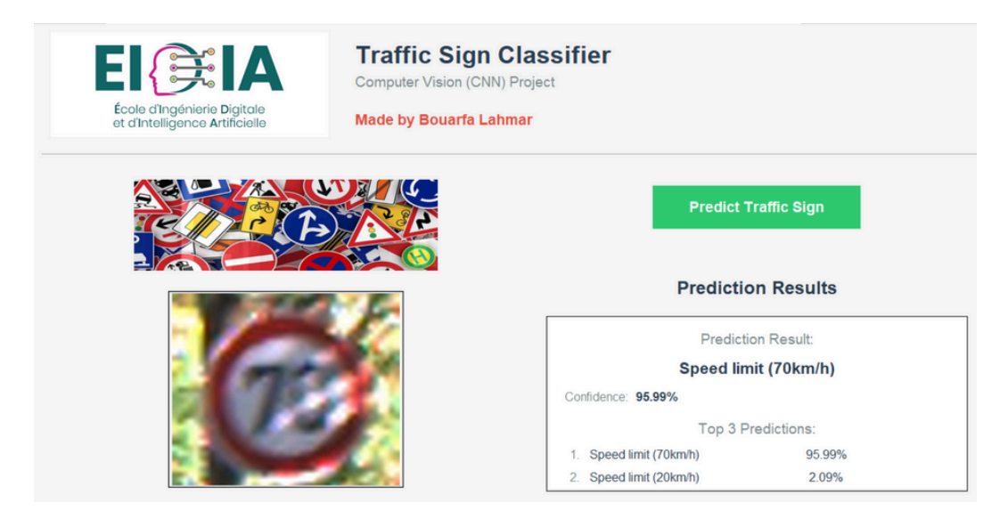

# 🚦 Traffic Sign Recognition using CNN

A deep learning project that implements a Convolutional Neural Network (CNN) to classify and predict traffic signs from images. This project includes both the machine learning model and a user-friendly graphical interface for real-time predictions.

## 🎯 Project Overview

This project focuses on automatic traffic sign recognition, which plays a crucial role in driver assistance systems and autonomous vehicles. By correctly identifying traffic signs, we can improve road safety and assist drivers in decision-making. The project implements a CNN model capable of classifying traffic signs from images and provides an intuitive GUI for easy interaction.

### Key Features

- **High Accuracy CNN Model**: Achieves 99.02% accuracy on test data
- **43 Traffic Sign Classes**: Recognizes various types of traffic signs (speed limits, prohibitions, warnings, etc.)
- **User-Friendly GUI**: Tkinter-based interface for easy image upload and prediction
- **Real-time Predictions**: Instant classification results with confidence scores
- **Comprehensive Evaluation**: Detailed performance metrics including precision, recall, and F1-score

## 🏷️ Classes Used for Training

These are the classes used to train this model:




## 🛠️ Technologies Used

- **Python 3.8+** - Main programming language
- **TensorFlow/Keras** - Deep learning framework for CNN implementation
- **OpenCV (cv2)** - Image processing and manipulation
- **NumPy** - Numerical computations and array operations
- **Pandas** - Data manipulation and analysis
- **Matplotlib** - Data visualization and plotting
- **scikit-learn** - Model evaluation and data splitting
- **Tkinter** - GUI development for user interface

## 📊 Dataset

- **Source**: GTSRB (German Traffic Sign Recognition Benchmark)
- **Size**: Over 50,000 images
- **Classes**: 43 different traffic sign categories
- **Image Format**: Color images (RGB)
- **Preprocessing**: Resized to 32×32 pixels, normalized (0-1 range)
- **Data Split**: 80% training, 20% testing

### Traffic Sign Categories
The dataset includes various types of traffic signs:
- Speed limit signs (20, 30, 50, 60, 70, 80, 100, 120 km/h)
- Warning signs (dangerous curves, road work, pedestrian crossing)
- Prohibition signs (no entry, no overtaking, no vehicles)
- Mandatory signs (turn right, go straight, roundabout)
- And many more...


2. **Steps to use**:
   - Click "Select Image" to choose a traffic sign image
   - Click "Predict" to get the classification result
   - View the prediction and confidence score

## 🏗️ Model Architecture

The CNN model consists of the following layers:

1. **Convolutional Layer 1**
   - 32 filters, 3×3 kernel size
   - ReLU activation
   - Input shape: (32, 32, 3)

2. **Max Pooling Layer 1**
   - Pool size: 2×2
   - Reduces spatial dimensions

3. **Convolutional Layer 2**
   - 64 filters, 3×3 kernel size
   - ReLU activation

4. **Max Pooling Layer 2**
   - Pool size: 2×2

5. **Flatten Layer**
   - Converts 2D feature maps to 1D vector

6. **Dense Layer**
   - 128 neurons
   - ReLU activation

7. **Dropout Layer**
   - Dropout rate: 0.5
   - Prevents overfitting

8. **Output Layer**
   - 43 neurons (number of classes)
   - Softmax activation

## 📈 Model Performance

The trained CNN model achieved excellent performance metrics:

### Performance Metrics
- **Accuracy**: 99.02%
- **Macro Recall**: 98.61%
- **Macro F1-Score**: 98.82%

## 📉 Accuracy & Loss Curves

This is the plot of the model's accuracy and loss during training:




### Key Results
- High accuracy demonstrates excellent generalization capability
- Balanced performance across all traffic sign classes
- Minimal false positives and false negatives
- Robust performance on unseen test data

## 🖥️ Graphical User Interface

The project includes a user-friendly GUI built with Tkinter that provides:

### Features
- **Image Selection**: Easy file browser for selecting traffic sign images
- **Real-time Preview**: Display selected image in the interface
- **Instant Prediction**: One-click prediction with immediate results
- **Confidence Display**: Shows prediction confidence scores
- **Supported Formats**: JPG, PNG, and other common image formats

### GUI Workflow
1. Launch the application
2. Click "Select Image" to choose a traffic sign photo
3. The selected image appears in the preview window
4. Click "Predict" to classify the traffic sign
5. View the predicted class and confidence score

## 🧪 User Interface – Model Testing (Part 1)

This is the user interface used to test the model and interact with it:




## 🔬 Key Findings

1. **CNN Effectiveness**: Convolutional layers successfully extract relevant features from traffic sign images
2. **Architecture Simplicity**: Simple yet effective architecture achieves excellent results
3. **Data Quality**: Well-preprocessed GTSRB dataset enables robust model training
4. **Generalization**: High test accuracy indicates good generalization to unseen data
5. **Practical Application**: GUI interface demonstrates real-world usability

## 🚀 Future Improvements

Several enhancements can be considered for future development:

- **Data Augmentation**: Implement rotation, scaling, and brightness adjustments
- **Advanced Architectures**: Experiment with VGG, ResNet, or EfficientNet
- **Transfer Learning**: Utilize pre-trained models for improved performance
- **Hyperparameter Optimization**: Fine-tune learning rate, batch size, and architecture
- **Real-time Processing**: Implement video stream processing for live detection
- **Mobile Deployment**: Create mobile app version for on-the-go usage

## 🤝 Contributing

Contributions are welcome! Please feel free to submit a Pull Request. For major changes, please open an issue first to discuss what you would like to change.

1. Fork the Project
2. Create your Feature Branch (`git checkout -b feature/AmazingFeature`)
3. Commit your Changes (`git commit -m 'Add some AmazingFeature'`)
4. Push to the Branch (`git push origin feature/AmazingFeature`)
5. Open a Pull Request

## 👨‍💼 Author

**BOUARFA LAHMAR**
- Supervised by: M. K. ELMOUTAOUKIL

## 📚 Documentation

For detailed technical documentation and analysis (in French), please refer to:

**[📋 Click here to see project report (French version)](RAPPORT_CNN.pdf)**

## 🙏 Acknowledgments

- GTSRB dataset creators for providing comprehensive traffic sign data
- TensorFlow/Keras team for the excellent deep learning framework
- OpenCV community for powerful image processing tools
- The open-source community for valuable libraries and resources


⭐ **If you found this project helpful, please give it a star!** ⭐

## 🏷️ Tags

`machine-learning` `deep-learning` `cnn` `computer-vision` `traffic-signs` `image-classification` `tensorflow` `keras` `python` `gui` `tkinter`
```
```

